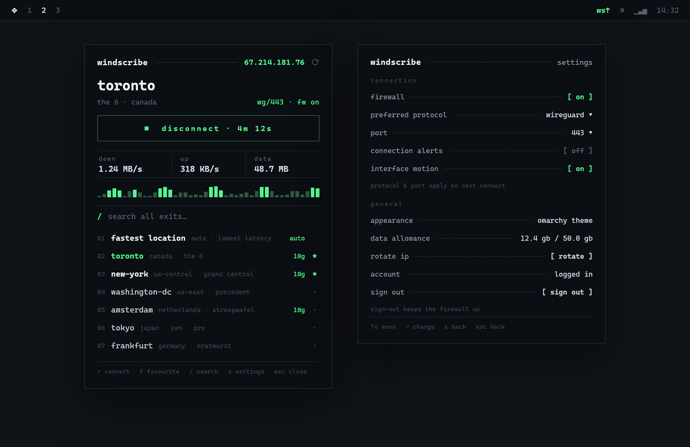

# Windscribe for Omarchy

Windscribe controls that belong in the bar.

Connect, pick an exit, watch live traffic, rotate your IP, and control the
Firewall without turning a terminal into permanent desk furniture.



## What it does

- Connects to your last exit or the **fastest location**
- Searches Windscribe cities, regions, country codes, and datacenter nicknames
- Keeps **Favourites** and recent destinations at the top of the list
- Shows live download/upload rates and a traffic wave from the tunnel interface
- Displays protocol, port, Firewall state, VPN IP, and session transfer
- Rotates the current VPN IP
- Controls the Windscribe **Firewall**
- Selects a preferred protocol and a live, protocol-specific port
- Reports tunnel verification and network-interference states
- Supports mouse and keyboard control

Connection controls use the official `windscribe-cli`; live traffic comes
from the tunnel interface's kernel counters.

## Install

```bash
omarchy plugin add https://github.com/yegors/windscribe-omarchy.git --enable
```

Then open the Windscribe bar widget:

1. **install windscribe**
2. **sign in**
3. **connect**

Credentials are entered directly into Windscribe's terminal prompt. The plugin
does not receive or store them.

## The panel

The home view is a single column of live fact:

- **Header** — the wordmark, your VPN IP in the accent colour while the
  tunnel is up (`off` otherwise), and a rotate control
- **Destination** — the current or next exit with its datacenter nickname
  and region, plus the live tunnel line: `wg/443 · fw on` when connected,
  `next: auto · fw off` when not
- **The button** — one full-width action: `▶ connect` (filled) or
  `■ disconnect · 4m 12s` (accent outline; the time is connection time
  observed while the panel is open)
- **down / up / data** — live rates and transfer observed while the panel
  is open
- **The wave** — forty-four bars of real tunnel activity
- **Exits** — a numbered list: favourites first (starred `*`), then recents,
  then every datacenter, with `10g` marking 10 Gbps exits and `pro` in the
  metadata. `/` searches everything.

The panel never looks up or guesses your physical location, and it shows no
numbers it cannot measure — which is why there are no per-exit latency
figures: `windscribe-cli` does not expose them. The fastest location row is
Windscribe's own latency-based choice.

## Settings

Press `s`. Every row is a real control:

- **firewall** — `[ on ]` / `[ off ]`, via `windscribe-cli firewall`;
  shows `[ always ]` when Windscribe has locked Always On
- **preferred protocol** — automatic, wireguard, udp, tcp, stealth, wstunnel
- **port** — populated live from `windscribe-cli ports` for that protocol
- **connection alerts** — desktop notifications on connect and unexpected drops
- **interface motion** — disables decorative animation
- **appearance** — follows the Omarchy theme; nothing to configure
- **data allowance** — plan usage as reported by the CLI
- **rotate ip** — new address, same exit (while connected)
- **update** — runs the official updater when one is advertised
- **sign out** — two-step confirm; an enabled Firewall stays enabled

Protocol and port apply on the next connect.

## Bar controls

- Left click: open or close the panel
- Right click: connect or disconnect
- Middle click: refresh status and locations

The badge is solid while active, dim while disconnected, and breathes during a
state change when interface motion is enabled.

## Keyboard

- `J` / `K` or arrows: move
- `Enter`: connect / toggle the selected control
- `/`: search exits
- `F`: toggle a favourite
- `S` or `←` / `→`: settings and back
- `T`: connect or disconnect
- `W`: toggle Firewall
- `R`: refresh
- `Esc`: leave search, close a menu, go back, then close

## Widget settings

Stored with the Omarchy bar entry:

- `refreshIntervalSec`: closed-panel status interval, from 2 to 60 seconds
- `preferredProtocol`: protocol with optional `:port`
- `notifications`: connection alert toggle
- `motion`: interface animation toggle
- `favoriteLocations`: managed by the stars in the exit list

## Scripting

```bash
vpn=com.windscribe.vpn
omarchy-shell "$vpn" toggle
omarchy-shell "$vpn" toggleVpn
omarchy-shell "$vpn" best
omarchy-shell "$vpn" connectTo "The 6"
omarchy-shell "$vpn" disconnect
omarchy-shell "$vpn" firewall on
omarchy-shell "$vpn" rotate
omarchy-shell "$vpn" refresh
omarchy-shell "$vpn" status
```

## Privacy and security

The plugin:

- stores no credentials, tokens, or account identity
- makes no location or telemetry requests of its own
- passes normal commands as argument arrays rather than shell strings
- validates user-entered locations before they reach the CLI
- renders CLI output as plain, sanitized text
- reads tunnel byte counters only while the panel is open
- stores recent location labels plus short-lived sign-in/update result markers
  under `~/.local/state/omarchy-windscribe/`

Install, sign-in, and update use Omarchy's floating terminal because those
commands may need interactive input.

## Development

```bash
./scripts/validate.sh
```

The validator runs Omarchy plugin validation, `qmllint`, and the Node parser
tests when Node is available.

## Acknowledgements

The Windscribe badge is redrawn from the official
[Windscribe Desktop App](https://github.com/Windscribe/Desktop-App) asset and
inherits the active Omarchy theme.


## License

[MIT](LICENSE)
